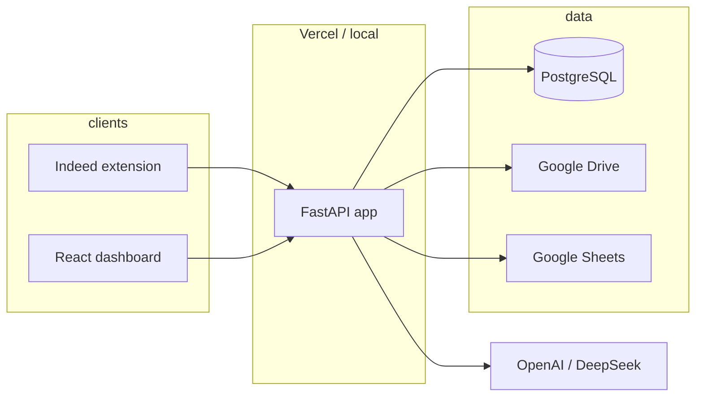

# Resume Builder — Project Overview

This repository is a **job-application resume pipeline**: a FastAPI backend generates tailored resumes (and related documents) from a job description, stores metadata in PostgreSQL, uploads files to Google Drive, optionally logs rows to Google Sheets, and exposes APIs consumed by a **React dashboard** and a **Chrome extension** for Indeed.

---

## Repository layout

| Area | Path | Role |
|------|------|------|
| **Backend** | `app/` | FastAPI app, SQLAlchemy models, route handlers, services (OpenAI/DeepSeek, Drive, Sheets, DOCX). |
| **Vercel entry** | `api/index.py` | Imports `app.main:app` for serverless deployment. |
| **Dashboard** | `dashboard/` | Vite + React 19 + TypeScript + Tailwind — analytics and generation list UI. |
| **Browser extension** | `extensions/indeed/` | MV3 extension: reads Indeed apply context and calls the deployed API. |
| **Rules & templates** | `resume_rules/`, `templates/` | Text rules and profile/JD templates used in generation. |
| **Samples & scripts** | `samples/` | Example DOCX generation / SQL snippets. |
| **Scraping (adjacent)** | `scrapping/` | HTML/JSON artifacts for job boards (Ashby, Indeed, Jobright); not wired into the main API. |

---

## Backend (`app/`)

- **Framework:** FastAPI (`app/main.py`).
- **Database:** SQLAlchemy 2.x + PostgreSQL (`psycopg`). Connection string from `DATABASE_URL` via `app/core/config.py` → `app/core/db.py`. Tables are created on startup (`Base.metadata.create_all`).
- **Primary entity:** `Generation` (`app/models/generation.py`) — one row per JD URL + profile, with pipeline `stage`, Drive URLs, model name, title/company, etc.

### HTTP API (prefix `/api` unless noted)

- **`POST /api/generate`** — Core flow: LLM resume generation, build DOCX (resume, JD, answers), parallel Drive upload, persist `Generation`, append Google Sheets row (best-effort).
- **`POST /api/check-generation-keys`** — Bulk existence check on `(url, profile_name)` for the extension.
- **`POST /api/check-urls`** — Legacy bulk URL duplicate check.
- **`GET /api/generations`** — Paginated list with optional search and stage filter.
- **`GET /api/generations/{id}`**, **`PATCH`**, **`DELETE`** — CRUD-style access for the dashboard.
- **`GET /api/dashboard/analytics`** — Aggregates (stages, models, profiles).
- **`GET /health`** — Liveness.

CORS is configured for browser and `chrome-extension://` origins (see `app/main.py`).

### Services (high level)

- **`openai_service`** — Resume text generation (supports OpenAI and DeepSeek-compatible endpoints per settings).
- **`document_service` / `resume_docx_formatter`** — DOCX assembly from AI output and job payload.
- **`drive_service`** — Google Drive uploads (credentials via env JSON).
- **`sheets_service`** — Append row to a configured Google Sheet (service account JSON).

### Configuration (environment)

Defined in `app/core/config.py` (also reads `app/.env` if present):

- `DATABASE_URL` — PostgreSQL.
- `OPENAI_API_KEY`, `OPENAI_BASE_URL` — primary LLM.
- `DEEPSEEK_API_KEY`, `DEEPSEEK_BASE_URL` — optional alternate provider.
- `GOOGLE_DRIVE_FOLDER_ID`, `DRIVE_TOKEN_JSON` — Drive.
- `GOOGLE_SHEETS_ID`, `GOOGLE_SERVICE_ACCOUNT_JSON`, `GOOGLE_SHEET_WORKSHEET` — Sheets.

Python dependencies are listed in `requirements.txt`.

---

## Dashboard (`dashboard/`)

- **Stack:** Vite 8, React 19, TypeScript, Tailwind 4.
- **API base URL:** `VITE_API_URL` in `.env` (see `dashboard/src/api/client.ts`). Empty string means same-origin (typical when API is proxied or served behind the same host).
- **Features:** Fetches `/api/dashboard/analytics`, paginated generations, patch/delete, Drive export link helpers.

Local dev: from `dashboard/`, `npm install` then `npm run dev`. Build: `npm run build`.

---

## Chrome extension (`extensions/indeed/`)

- **Manifest V3** — content scripts on `https://www.indeed.com/*`, background service worker, popup.
- **Host permissions** include a Vercel deployment host (see `manifest.json`); update when changing API origin.
- Uses storage and scripting to collect job/apply data and invoke the backend (generate / duplicate checks).

---

## Deployment

- **Root `vercel.json`:** Python serverless build on `api/index.py`, catch-all route to the ASGI app, global CORS headers.
- More detail: `VERCEL_DEPLOYMENT_PLAN.md`.
- Backend roadmap and technical debt: `BACKEND_IMPROVEMENT_PLAN.md`.

---

## How the pieces connect



---

## Quick local backend run

From the repo root (with a virtualenv and `DATABASE_URL` set):

```bash
pip install -r requirements.txt
uvicorn app.main:app --reload --host 0.0.0.0 --port 8000
```

Ensure `app/.env` or process environment supplies keys and URLs as required for generate and uploads.

---

*Last reviewed against the repository layout and main entry points. For deep backend or deploy steps, prefer the dedicated plan documents in this folder.*
